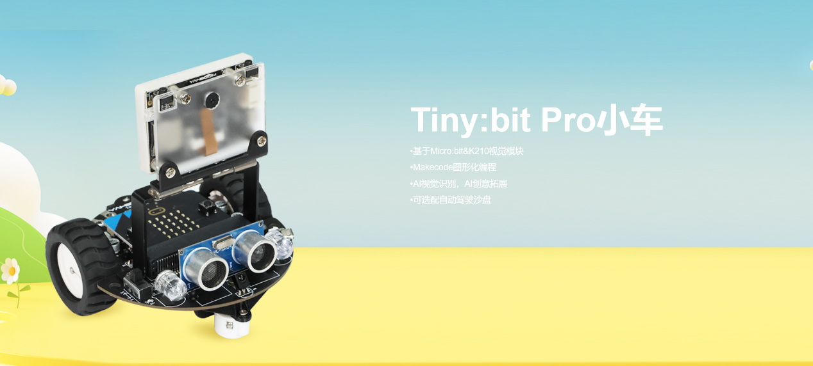
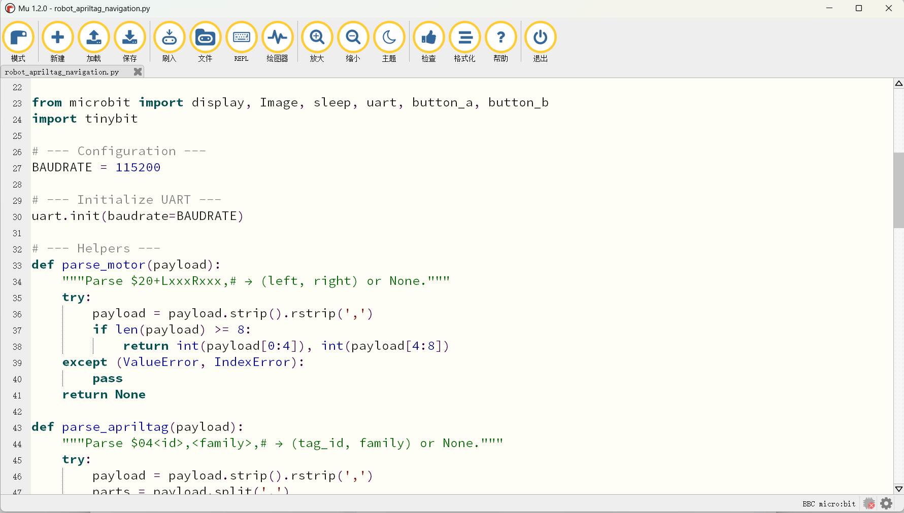

# ProjectRobot1_2026

ProjectRobot1 is a micro:bit-based intelligent robot car controlled by a Python application running on a host PC. The system integrates multiple control modalities — keyboard teleoperation, directional navigation, speed profiling, and geometric path following — into a single, unified, menu-driven interface.

The robot's intelligence is distributed across two processors:

micro:bit v2 (Nordic nRF52833, 64 MHz ARM Cortex-M4) — Handles real-time motor PWM control, GPIO input/output, LED matrix display, and serial message parsing from the host PC.

Sipeed Maix Bit (K210, 400 MHz RISC-V with 0.8 TOPS KPU) — AI coprocessor for camera capture (OV2640, 320×240 @ 30fps), neural network inference, and LCD display output.

Communication between the host PC and the robot uses a simple, robust text-based protocol over UART at 115200 baud. Commands from the PC to the robot are formatted as "$<2-char command code><variable-length payload>". For example, a movement command to set both motors to speed 150 would be "$20+L150+R150,#". The micro:bit parses this message and generates the corresponding PWM signals to the TB6612 motor driver.

What are the functions of these Python files?

| # | File | Description |
| --- | --- | --- |
| — | robot_utils.py | Shared module: serial, motor control, PID, path planner, logger, safety guard |
| 1 | robot_basic_move.py | Keyboard-driven forward/backward/turn/stop with speed levels 1-9 |
| 2 | robot_direction_control.py | Angle-based (0-360°) and compass (N/NE/E/...) movement; 5 demos |
| 3 | robot_speed_control.py | Speed profiles: ramp, trapezoidal, S-curve, sine wave, custom waypoints |
| 4 | robot_path_control.py | 11 predefined paths: square, rectangle, triangle, circle, figure-8, zigzag, spiral, snake, lawn-mower, polygon, star + custom builder |
| 5 | robot_color_tracking.py | PID-based colour object tracking with 2D PID, search mode, simulation |
| 6 | robot_line_following.py | PID line following with junction detection, simulation + keyboard test |
| 7 | robot_apriltag_navigation.py | AprilTag following, mission execution (tag sequence), virtual tag field |
| 8 | robot_qrcode_commander.py | QR/barcode command parser (FWD, BACK, LEFT, RIGHT, SQUARE, CIRCLE, etc.) |
| 9 | robot_face_recog_control.py | Face recognition with user DB, behaviour mapping (greet/follow/dance/stop) |
| 10 | robot_object_detect_nav.py | VOC20 object→behaviour mapping + road sign detection |
| 11 | robot_gesture_control.py | Face-position zone mapping to commands + keyboard gesture simulation |
| 12 | robot_mnist_control.py | MNIST digit 0-9 → robot commands + autonomous mode |
| 13 | robot_obstacle_avoidance.py | 5 strategies: simple, random, smart, wall-follow, cautious |
| 14 | robot_voice_command.py | 40+ natural language commands with fuzzy matching |
| 15 | robot_autonomous_explore.py | Occupancy grid mapping, 5 exploration strategies, curiosity-driven BFS |
| 16 | robot_self_learning_nav.py | K210 self-learning (3 classes), trainable mappings, config save/load |
| ★ | robot_complete.py | All 16 modes integrated in one unified menu-driven program |

How to configure the HEX file?

Click here [Hex烧录参考手册（PDF）](./docs/Hex_Flashing_Guide.pdf) I have summarized all scenarios.

How to run the code?

Open Mu Editor, click the flashing icon.

